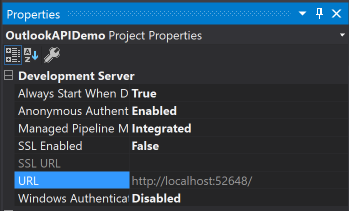
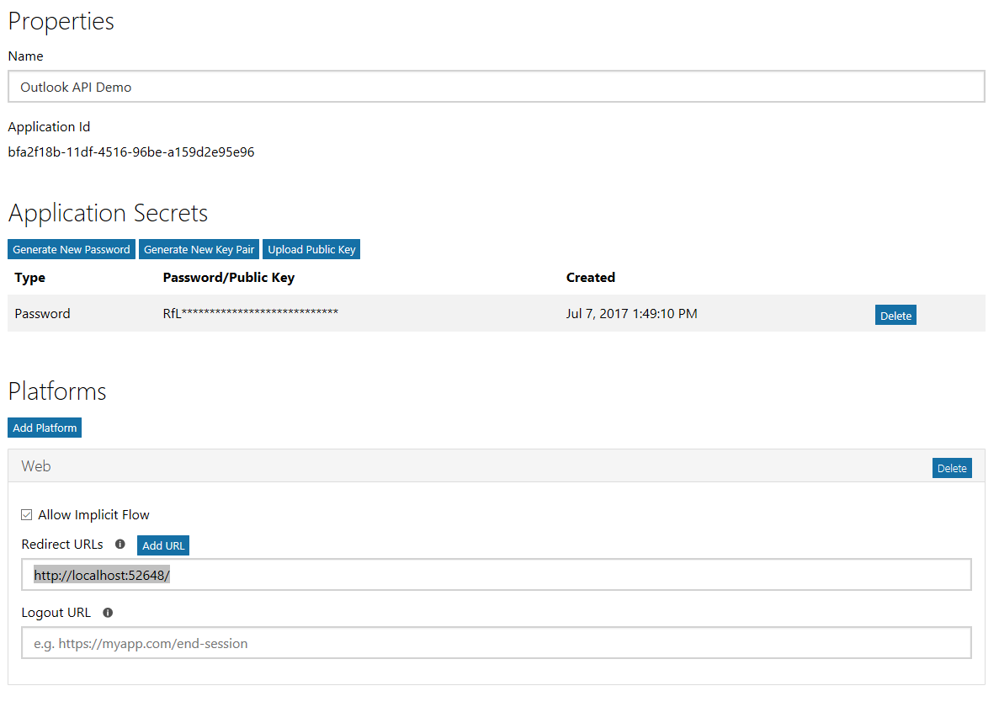

# Outlook API Demo

This web app calls the Outlook API endpoints directly, rather than use the Microsoft Graph endpoints.

## Prerequisites

- Visual Studio 2017.
- An Office 365 tenant, with access to an administrator account in that tenant, **OR** an Outlook.com account.

## Register the app

Head over to https://apps.dev.microsoft.com to quickly get a application ID and password. Click the **Sign in** link and sign in with either your Microsoft account (Outlook.com), or your work or school account (Office 365).

Once you're signed in, click the **Add an app** button. Enter `dotnet-tutorial` for the name and click **Create application**. After the app is created, locate the **Application Secrets** section, and click the **Generate New Password** button. Copy the password now and save it to a safe place. Once you've copied the password, click **Ok**.

Locate the **Platforms** section, and click **Add Platform**. Choose **Web**, then enter `http://localhost:<PORT>` under **Redirect URIs**, where `<PORT>` is the port number that the Visual Studio Development Server is using for your project. You can locate this by selecting the `OutlookAPIDemo` project in Solution Explorer, then checking the value for `URL` in the Properties window.

> **NOTE:** The values in **Redirect URIs** are case-sensitive, so be sure to match the case!

Click **Save** to complete the registration. Copy the **Application Id** and save it along with the password you copied earlier. We'll need those values soon.

Here's what the details of your app registration should look like when you are done.

## Configure the sample

1. Open the dotnet-tutorial.sln file.
1. Right-click **References** in Solution Explorer and choose **Manage NuGet Packages**.
1. Click the **Restore** button in the **Manage NuGet Packages** dialog to download all of the required packages.
1. Open the `Web.config` file and locate the `<add key="ida:AppId" value="YOUR APP ID HERE" />` line. Replace `YOUR APP ID HERE` with the **Application Id** from the registration you just created.
1. Locate the `<add key="ida:AppPassword" value="YOUR APP PASSWORD HERE" />` line. Replace `YOUR APP PASSWORD HERE` with the password you copied earlier.

## Copyright ##

Copyright (c) Microsoft. All rights reserved.

----------
Connect with me on Twitter [@JasonJohMSFT](https://twitter.com/JasonJohMSFT)

Follow the [Outlook/Exchange Dev Blog](https://blogs.msdn.microsoft.com/exchangedev/)